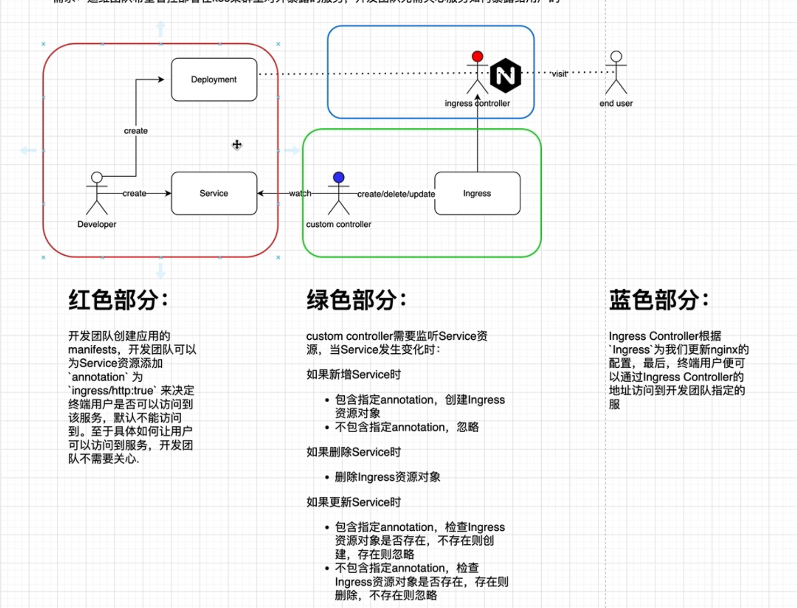

# ingress manager example

本示例为参考 [GitHub - ingress manager](https://github.com/baidingtech/operator-lesson-demo/tree/main/11) 实现以下需求:


前提: 参考 [Kind - Ingress](https://kind.sigs.k8s.io/docs/user/ingress/) 配置好 kind ingress.

## 1.本地运行

```shell
# 运行go程序
$ go run main.go

# 加载镜像
$ docker pull registry.k8s.io/e2e-test-images/agnhost:2.39 && kind load docker-image registry.k8s.io/e2e-test-images/agnhost:2.39 --name=1c2w

# 创建foo资源
$ kubectl apply -f manifests/foo-example.yaml
deployment.apps/foo-deploy created
service/foo-service created

# 查看foo资源
$ kubectl get deploy,service
NAME                         READY   UP-TO-DATE   AVAILABLE   AGE
deployment.apps/foo-deploy   1/1     1            1           11s

NAME                  TYPE        CLUSTER-IP      EXTERNAL-IP   PORT(S)    AGE
service/foo-service   ClusterIP   10.96.180.214   <none>        8080/TCP   11s
service/kubernetes    ClusterIP   10.96.0.1       <none>        443/TCP    5h2m

# 查看自动创建的ingress资源
$ kubectl get ingress
NAME          CLASS                 HOSTS         ADDRESS                            PORTS   AGE
foo-service   cloud-provider-kind   example.com   172.18.0.5,fc00:f853:ccd:e793::5   80      21s

# 配置host: 添加如下内容
# 172.18.0.5 example.com

# 测试
$ curl http://example.com/foo
foo-deploy-95c975f-4t974

# 测试修改service foo-service annotation ingress/http, 查看ingress变化
# 测试删除ingress foo-service, 查看ingress变化
```

## 2.k8s集群运行

```shell
# 构建镜像
$ docker build --progress=plain --no-cache -t ingress-manager-example:v1.0 .

# 加载镜像
$ kind load docker-image ingress-manager-example:v1.0 --name=1c2w

# 创建ingress-manager-example资源
$ kubectl apply -f manifests/ingress-manager-example.yaml

# 创建foo资源
$ kubectl apply -f manifests/foo-example.yaml

# 测试, 参考1.本地运行
```
